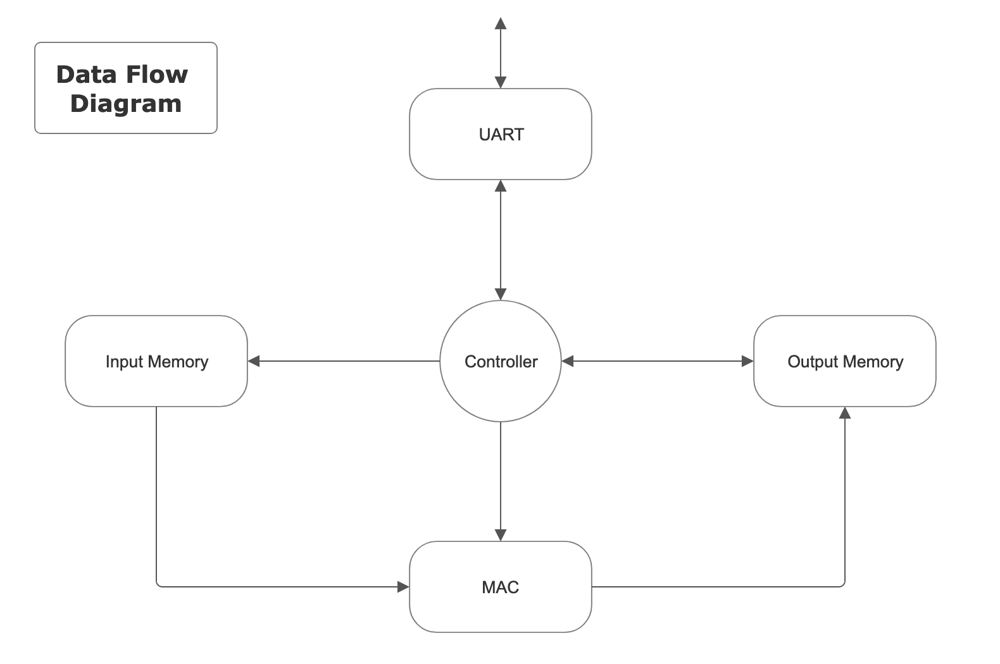

# veriMM
a Verilog Matrix Multiplier implementation designed for Nexys3 FPGA. This includes designing the following main modules,
* **UART** __ which sends and receives data at a baud rate of 9600
* **MAC** __ which multiplies the operand with its value and accumulates the results
* **Memory** __ to store input and output values
* **Controller** __ to control all the top-level tasks

Other modules are also designed to support the operations as well. However, their function is visible only on lower levels of abstraction.

## Design

